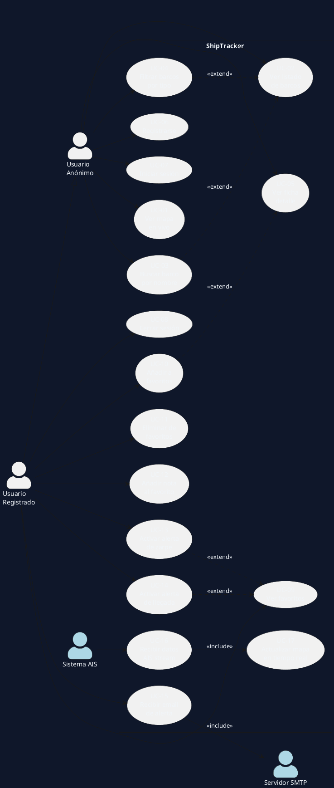

# Actividad 2 — Diagrama de Casos de Uso
**ShipTracker · Proyecto DAW 2025 · Aaron Del Toro Arias**

---

## 1. Actores del sistema

| Actor | Descripción |
|-------|-------------|
| **Usuario Anónimo** | Visitante sin autenticar. Puede ver el mapa, el listado y la ficha de barcos |
| **Usuario Registrado** | Usuario con sesión iniciada. Hereda todo lo del anónimo y además gestiona favoritos y alertas |
| **Sistema AIS** | Actor externo. Servicio aisstream.io que envía posiciones de barcos vía WebSocket |
| **Servidor SMTP** | Actor externo. Gmail SMTP que entrega las notificaciones por email |

---

## 2. Diagrama de casos de uso (PlantUML)



---

## 3. Descripción detallada de casos de uso

---

### UC-01 — Ver mapa en vivo

| Campo | Valor |
|-------|-------|
| **Actor principal** | Usuario Anónimo |
| **Precondición** | Aplicación en ejecución |
| **Flujo normal** | 1. El usuario accede a `/map` · 2. El servidor renderiza el mapa Leaflet con los barcos actuales · 3. El browser abre una conexión WebSocket `ws://…/ws/ships` · 4. El servidor envía un snapshot inicial con todos los barcos · 5. Cada actualización AIS llega como push sin recargar la página |
| **Postcondición** | El mapa muestra marcadores actualizados en tiempo real |
| **Flujo alternativo** | Si no hay datos AIS reales → el servidor sirve 18 barcos mock |

---

### UC-02 — Ver listado de barcos

| Campo | Valor |
|-------|-------|
| **Actor principal** | Usuario Anónimo |
| **Precondición** | Aplicación en ejecución |
| **Flujo normal** | 1. El usuario accede a `/ships` · 2. Se muestra tabla paginada con nombre, MMSI, tipo, bandera, velocidad y estado |
| **Postcondición** | Listado visible con todos los barcos disponibles |

---

### UC-03 — Buscar barco por nombre

| Campo | Valor |
|-------|-------|
| **Actor principal** | Usuario Anónimo |
| **Precondición** | Estar en `/ships` |
| **Flujo normal** | 1. El usuario escribe un término en el campo de búsqueda · 2. Se hace GET `/ships?search=término` · 3. `MarineApiService.searchByName()` filtra el caché por coincidencia parcial |
| **Postcondición** | Solo aparecen barcos cuyo nombre contiene el término buscado |

---

### UC-04 — Filtrar barcos por tipo

| Campo | Valor |
|-------|-------|
| **Actor principal** | Usuario Anónimo |
| **Flujo normal** | 1. El usuario selecciona un tipo (Cargo, Tanque, Pasajeros, Pesca…) · 2. GET `/ships?type=Cargo` · 3. `MarineApiService.filterByType()` filtra el caché |
| **Postcondición** | Solo aparecen barcos del tipo seleccionado |

---

### UC-05 — Ver ficha detalle de barco

| Campo | Valor |
|-------|-------|
| **Actor principal** | Usuario Anónimo |
| **Flujo normal** | 1. El usuario hace clic en un barco · 2. GET `/ships/{mmsi}` · 3. Se muestra ficha con todos los datos AIS: MMSI, IMO, indicativo, tipo, bandera, posición, velocidad, rumbo, destino, dimensiones · 4. Si el barco tiene IMO, se consulta Equasis para datos adicionales |
| **Postcondición** | Ficha completa del buque visible |
| **Flujo alternativo** | Si no hay datos Equasis → se muestra solo lo disponible por AIS |

---

### UC-06 — Registrarse

| Campo | Valor |
|-------|-------|
| **Actor principal** | Usuario Anónimo |
| **Flujo normal** | 1. GET `/register` · 2. El usuario rellena: nombre de usuario, email, contraseña (mín. 6 chars), confirmación · 3. POST `/register` · 4. `UserService` valida unicidad de usuario y email, cifra la contraseña con BCrypt, guarda en BD |
| **Postcondición** | Usuario creado con rol USER, redirige a `/login` |
| **Flujo alternativo** | Si el usuario o email ya existen → mensaje de error en el formulario |

---

### UC-07 — Iniciar sesión

| Campo | Valor |
|-------|-------|
| **Actor principal** | Usuario Anónimo |
| **Flujo normal** | 1. GET `/login` · 2. El usuario introduce credenciales · 3. Spring Security valida contra BD (BCrypt) · 4. Redirige a `/map` |
| **Postcondición** | Sesión activa, acceso a rutas protegidas |
| **Flujo alternativo** | Credenciales incorrectas → mensaje "Usuario o contraseña incorrectos" |

---

### UC-08 — Cerrar sesión

| Campo | Valor |
|-------|-------|
| **Actor principal** | Usuario Registrado |
| **Flujo normal** | 1. El usuario hace clic en "Salir" · 2. POST `/logout` (con token CSRF) · 3. Spring Security invalida la sesión |
| **Postcondición** | Sesión eliminada, redirige a `/login` |

---

### UC-09 — Ver favoritos

| Campo | Valor |
|-------|-------|
| **Actor principal** | Usuario Registrado |
| **Precondición** | Sesión activa |
| **Flujo normal** | 1. GET `/favorites` · 2. `FavoriteService.getUserFavorites()` devuelve la lista ordenada por fecha · 3. Se muestran tarjetas con nombre, MMSI, tipo, bandera, notas y controles de alerta |
| **Postcondición** | Lista de favoritos visible |

---

### UC-10 — Añadir a favoritos

| Campo | Valor |
|-------|-------|
| **Actor principal** | Usuario Registrado |
| **Precondición** | Estar en ficha detalle de un barco |
| **Flujo normal** | 1. El usuario hace clic en "Añadir a favoritos" · 2. POST `/favorites/add` con MMSI · 3. `FavoriteService.addFavorite()` crea el registro en BD (idempotente) |
| **Postcondición** | Barco aparece en `/favorites` |

---

### UC-11 — Eliminar de favoritos

| Campo | Valor |
|-------|-------|
| **Actor principal** | Usuario Registrado |
| **Flujo normal** | 1. En `/favorites`, el usuario hace clic en "Eliminar" · 2. POST `/favorites/remove` con MMSI · 3. `FavoriteService.removeFavorite()` borra de BD |
| **Postcondición** | Barco eliminado de la lista |

---

### UC-12 — Añadir nota al favorito

| Campo | Valor |
|-------|-------|
| **Actor principal** | Usuario Registrado |
| **Flujo normal** | 1. En `/favorites`, el usuario escribe en el área de texto · 2. POST `/favorites/{id}/notes` · 3. `FavoriteService.updateNotes()` actualiza el campo `notes` |
| **Postcondición** | Nota guardada y visible en la tarjeta del favorito |

---

### UC-13 — Activar alerta de zarpe

| Campo | Valor |
|-------|-------|
| **Actor principal** | Usuario Registrado |
| **Flujo normal** | 1. En `/favorites`, activa el checkbox "Aviso al zarpar" · 2. POST `/favorites/{id}/alerts` con `alertOnDeparture=true` · 3. `FavoriteService.updateAlerts()` activa el flag en BD |
| **Postcondición** | Cuando el barco pase a "En navegación", el usuario recibirá un email |

---

### UC-14 — Activar alerta de llegada

| Campo | Valor |
|-------|-------|
| **Actor principal** | Usuario Registrado |
| **Flujo normal** | Igual que UC-13 pero con checkbox "Aviso al atracar" y `alertOnArrival=true` |
| **Postcondición** | Cuando el barco pase a "Atracado", el usuario recibirá un email |

---

### UC-15 — Recibir email de alerta

| Campo | Valor |
|-------|-------|
| **Actor principal** | Usuario Registrado |
| **Actor secundario** | Servidor SMTP (Gmail) |
| **Precondición** | UC-13 o UC-14 activos para el barco |
| **Flujo normal** | 1. `AisStreamService` detecta cambio de estado AIS · 2. Publica `ShipStatusChangedEvent` · 3. `ShipAlertService.onStatusChanged()` consulta los favoritos con alerta activa para ese MMSI · 4. Construye email HTML y llama a `JavaMailSender.send()` · 5. Gmail entrega el email al usuario |
| **Postcondición** | Usuario recibe email con el nombre del barco, descripción del evento y enlace directo a la ficha |

---

### UC-16 — Recibir datos AIS stream

| Campo | Valor |
|-------|-------|
| **Actor principal** | Sistema AIS (aisstream.io) |
| **Flujo normal** | 1. Al arrancar, `AisStreamService` abre `wss://stream.aisstream.io/v0/stream` · 2. Envía suscripción JSON con API key y bounding box · 3. Recibe mensajes `PositionReport` y `ShipStaticData` · 4. Actualiza el caché `ConcurrentHashMap<String, ShipDTO>` · 5. Si cambia el estado navegacional → publica evento |
| **Postcondición** | Caché siempre actualizado con las últimas posiciones |
| **Flujo alternativo** | Si se pierde la conexión → `@Scheduled` lo reconecta cada 30 s |

---

### UC-17 — Actualizar mapa en tiempo real

| Campo | Valor |
|-------|-------|
| **Actor principal** | Sistema AIS (trigger) |
| **Flujo normal** | 1. Cada vez que `AisStreamService` actualiza un barco, llama a `broadcastUpdate(ship)` · 2. `ShipWebSocketHandler` envía el JSON `{type:"update", ship:{…}}` a todas las sesiones de browser activas · 3. El JavaScript en el browser actualiza la posición del marcador en Leaflet |
| **Postcondición** | Todos los usuarios con el mapa abierto ven el marcador moverse sin recargar |

---

### UC-18 — Cambiar zona de seguimiento AIS al mover el mapa

| Campo | Valor |
|-------|-------|
| **Actor principal** | Usuario Anónimo / Registrado |
| **Precondición** | Mapa abierto con WebSocket conectado |
| **Flujo normal** | 1. El usuario arrastra o hace zoom en el mapa · 2. Tras 800 ms sin movimiento, el JavaScript calcula el bounding box visible (`map.getBounds()`) · 3. Envía por WebSocket el mensaje `{type:"viewport", minLat, maxLat, minLng, maxLng}` · 4. `ShipWebSocketHandler` lo recibe y llama a `AisStreamService.updateViewport()` · 5. El servidor limpia el caché y cierra la suscripción AIS actual · 6. Abre una nueva suscripción a aisstream.io con el nuevo bounding box · 7. Empiezan a llegar barcos de la nueva zona y se muestran en el mapa |
| **Postcondición** | El mapa muestra los barcos de la zona actualmente visible en pantalla |
| **Flujo alternativo** | Si la API key no está configurada → `updateViewport()` no hace nada (modo mock) |

---

## 4. Diagrama de secuencia — Flujo de alerta por email

```
Usuario      Browser       Server          AisStreamService    ShipAlertService    Gmail SMTP
   |            |              |                  |                   |                |
   |--activa--> |              |                  |                   |                |
   |  checkbox  |--POST /alerts|                  |                   |                |
   |            |              |--updateAlerts()-->|                   |                |
   |            |              |  (BD: flag=true)  |                   |                |
   |            |              |                  |                   |                |
   ~~~~~~~~~~~~~~~~~~~~~~~~~~~~~~ (más tarde) ~~~~~~~~~~~~~~~~~~~~~~~~~~~~~~~~~~~~~~~~~~~~~~~~~~~
   |            |              |   AIS msg llega  |                   |                |
   |            |              |                  |--publishEvent()-->|                |
   |            |              |                  |   ShipStatusChangedEvent           |
   |            |              |                  |                   |--findAlerts()  |
   |            |              |                  |                   |   (BD query)   |
   |            |              |                  |                   |--send()--->    |
   |            |              |                  |                   |            --> email entregado
   |<--recibe email----------------------------------                  |                |
```
